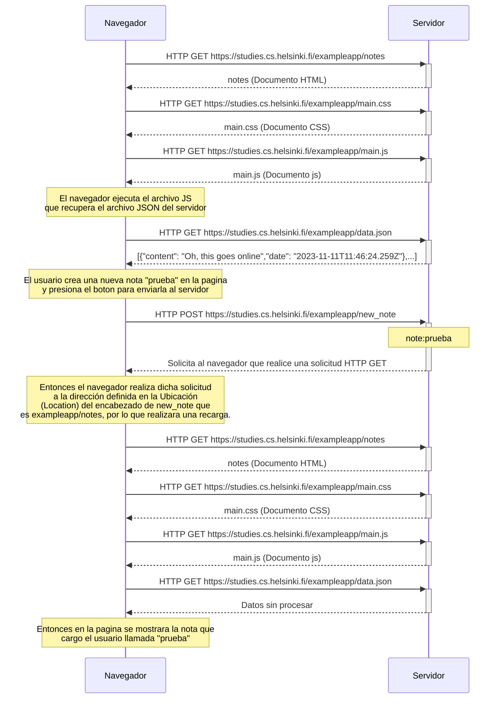

## Ejercicio 4

```mermaid
sequenceDiagram
    participant N as Navegador
    participant S as Servidor

    N->>+S:HTTP GET https://studies.cs.helsinki.fi/exampleapp/notes
    S-->>-N:notes (Documento HTML)

    N->>+S:HTTP GET https://studies.cs.helsinki.fi/exampleapp/main.css
    S-->>-N:main.css (Documento CSS)

    N->>+S:HTTP GET https://studies.cs.helsinki.fi/exampleapp/main.js
    S-->>-N:main.js (Documento js)

    Note over N: El navegador ejecuta el archivo JS <br/> que recupera el archivo JSON del servidor

    N->>+S:HTTP GET https://studies.cs.helsinki.fi/exampleapp/data.json
    S-->>-N:[{"content": "Oh, this goes online","date": "2023-11-11T11:46:24.259Z"},...]

    Note over N: El usuario crea una nueva nota "prueba" en la pagina <br/> y presiona el boton para enviarla al servidor

    N->>+S:HTTP POST https://studies.cs.helsinki.fi/exampleapp/new_note

    Note over S: note:prueba

    S-->>-N:Solicita al navegador que realice una solicitud HTTP GET

    Note over N: Entonces el navegador realiza dicha solicitud <br> a la dirección definida en la Ubicación <br> (Location) del encabezado de new_note que <br/> es exampleapp/notes, por lo que realizara una recarga.

    N->>+S:HTTP GET https://studies.cs.helsinki.fi/exampleapp/notes
    S-->>-N:notes (Documento HTML)

    N->>+S:HTTP GET https://studies.cs.helsinki.fi/exampleapp/main.css
    S-->>-N:main.css (Documento CSS)

    N->>+S:HTTP GET https://studies.cs.helsinki.fi/exampleapp/main.js
    S-->>-N:main.js (Documento js)

    N->>+S:HTTP GET https://studies.cs.helsinki.fi/exampleapp/data.json
    S-->>-N: Datos sin procesar

    Note over N: Entonces en la pagina se mostrara la nota que <br> cargo el usuario llamada "prueba"
```