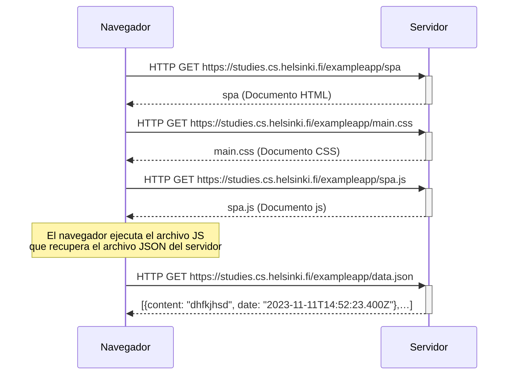

## Ejercicio 5

```mermaid
sequenceDiagram
    participant N as Navegador
    participant S as Servidor

    N->>+S:HTTP GET https://studies.cs.helsinki.fi/exampleapp/spa
    S-->>-N:spa (Documento HTML)

    N->>+S:HTTP GET https://studies.cs.helsinki.fi/exampleapp/main.css
    S-->>-N:main.css (Documento CSS)

    N->>+S:HTTP GET https://studies.cs.helsinki.fi/exampleapp/spa.js
    S-->>-N:spa.js (Documento js)

    Note over N: El navegador ejecuta el archivo JS <br/> que recupera el archivo JSON del servidor

    N->>+S:HTTP GET https://studies.cs.helsinki.fi/exampleapp/data.json
    S-->>-N:[{content: "dhfkjhsd", date: "2023-11-11T14:52:23.400Z"},…]
```